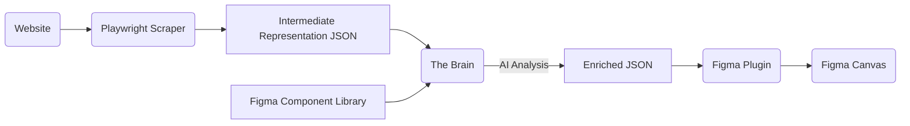

# Website to Figma Scraper & Plugin Analysis

> [!CAUTION]
> **Archival Document**: This analysis represents the initial exploration phase. The actual implementation (Puppeteer + React Plugin + Image Proxy) has evolved significantly from this original plan. Refer to `docs/guides/how-to-run.md` and `docs/TOOLS.md` for the current state.

## Executive Summary
This document analyzes the feasibility and technical approach for creating a "Website to Figma" workflow that scrapes web pages and reconstructs them as editable Figma designs. The proposed solution involves a hybrid approach using rule-based parsing for structure/styles and AI for semantic component mapping.

**Verdict:** **DOABLE**, but with significant complexity in handling layout edge cases and ensuring high-fidelity reproduction.

## System Architecture

The system will consist of three main components:

1.  **The Scraper (Headless Browser)**: Extracts the DOM, computed styles, and assets.
2.  **The Brain (Processing Core)**:
    *   **Normalizer**: Converts HTML/CSS to a Figma-agnostic Intermediate Representation (IR).
    *   **AI Mapper**: Analyzes the IR to match elements against a user-provided Figma Component Library and Token System.
3.  **The Figma Plugin**: Receives the processed JSON and executes the reconstruction on the canvas within Figma.

## Technical Feasibility Breakdown

### 1. Figma Plugin Capabilities
Research confirms the Figma Plugin API fully supports the required operations:
*   **AutoLayout**: `FrameNode` properties like `layoutMode`, `primaryAxisAlignItems`, `padding`, `itemSpacing` map directly to Flexbox concepts.
*   **Components**: `figma.importComponentByKeyAsync(key)` allows instantiating components from shared libraries.
*   **Variables**: `node.setBoundVariable(field, variable)` allows binding stylistic tokens (colors, spacing, radius) to nodes.
*   **Vector/SVG**: `figma.createNodeFromSvg(svgString)` handles icons and complex shapes.

### 2. Scraping & Style Extraction
We need a robust scraper (likely Playwright/Puppeteer) to traverse the DOM.
*   **Challenge**: `window.getComputedStyle` gives absolute values (pixels).
*   **Solution**: We must calculate relative values for responsiveness.
*   **Layout Mapping**:
    *   `display: flex` -> `layoutMode: HORIZONTAL/VERTICAL`
    *   `gap` -> `itemSpacing`
    *   `padding` -> `paddingTop`, etc.
    *   `grid` -> Complex. Figma doesn't natively support CSS Grid. We must approximate using nested AutoLayouts or fall back to absolute positioning for strict grids.

### 3. AI Component & Token Mapping (The Core Innovation)
This is the most ambitious part.
*   **Input to AI**: A simplified JSON of a specific DOM branch (e.g., a Button wrapper).
    *   `{ tag: "button", text: "Submit", styles: { bg: "#000", radius: "4px" } }`
*   **Context for AI**: A schema of available Figma Components and Tokens.
    *   `Button: { variants: ["Primary", "Secondary"], properties: ["Label", "Icon"] }`
    *   `Tokens: { "color/primary": "#000", "radius/sm": "4px" }`
*   **AI Task**: Fuzzy match the DOM element to the best Component configuration.
    *   *Result*: `Use Component "Button" (Variant="Primary", Label="Submit")`
*   **Hybrid Fallback**: If AI confidence is low/no match found, fall back to "Raw Reconstruction" (creating a standard Frame with AutoLayout).

## Detailed Strategy

### Step 1: The Scraper (HTML -> IR)
The scraper will produce a JSON tree. Instead of raw HTML, it will clean the data:
*   Remove invisible elements (`display: none`, `visibility: hidden`).
*   Inlining SVGs.
*   Converting images to Base64 or URLs.
*   Capturing critical Computed Styles:
    *   `color`, `background-color`
    *   `font-family`, `font-size`, `font-weight`, `line-height`
    *   `padding`, `margin`, `border-radius`, `border`
    *   `display`, `flex-direction`, `justify-content`, `align-items`, `gap`
    *   `position`, `top`, `left`, `width`, `height`

### Step 2: The Interpreter (IR -> Semantic JSON)
This step runs heuristics and AI.
*   **Token Matching**:
    *   Compare hex codes to known tokens (tolerant matching, e.g., if code is `#000001` and token is `#000000`, match with warning).
    *   Match Spacing values (4px, 8px, 16px) to spacing tokens.
*   **Component Detection**:
    *   Identify clusters (e.g., `div > svg + span`).
    *   Send cluster structure to LLM: *"I have a div with an icon and text. Here are my available list components. Which one matches best?"*
    *   LLM responds with Component Key and Property Mapping.

### Step 3: Reconstruction (Figma Plugin)
The plugin receives the plan.
*   **Pre-load**: Fetch all required Components and Variables.
*   **Recursive Build**:
    *   Create Root Frame (Page).
    *   Traverse children.
    *   **If Component Match**: `importComponentByKeyAsync`, set properties, detach if necessary (or keep instance).
    *   **If Raw**: Create `FrameNode`, apply `AutoLayout`, set fills/strokes.
    *   **Apply Tokens**: Call `setBoundVariable` for matched properties.

## Challenges & Risks
1.  **CSS Grid**: Hard to map to AutoLayout. *Mitigation*: Fallback to Frames without AutoLayout or attempt "row/column" approximation.
2.  **Pseudo-elements (::before/::after)**: These are separate nodes in the visual tree but not in DOM structure. *Mitigation*: Scraper must explicitly check for content in pseudo-elements and create distinct nodes for them.
3.  **Authentication**: Scraper might be blocked by bot detection.
4.  **Performance**: Sending every generic `div` to AI is too slow. *Mitigation*: Heuristics first. Only send "Component Candidates" (buttons, cards, navbars, inputs) to AI.

## Implementation Roadmap

### Phase 1: The Foundation - "Pixel Perfect" Raw Import
**Goal**: Scrape a page and rebuild it in Figma using simple Frames and AutoLayout. No components, no tokens.
- [ ] Build Playwright scraper for DOM -> JSON.
- [ ] Build Figma Plugin with `createFrame`, `createAutoLayout` logic.
- [ ] Handle Text, Images, SVGs.

### Phase 2: The Intelligence - Tokens & Variables
**Goal**: Connect Figma Variables (Design Tokens) to the import.
- [ ] Implement color matching algorithm (Code color -> Figma Variable).
- [ ] Implement spacing/radius matching.

### Phase 3: The Magic - AI Component Mapping
**Goal**: Replace raw frames with real library components.
- [ ] Implement "Component Discovery" in scraper data.
- [ ] Build LLM prompt pipeline for "DOM vs Component Library" matching.
- [ ] Handle Component Property mapping (Text content -> String prop, Icon -> Instance swap).
